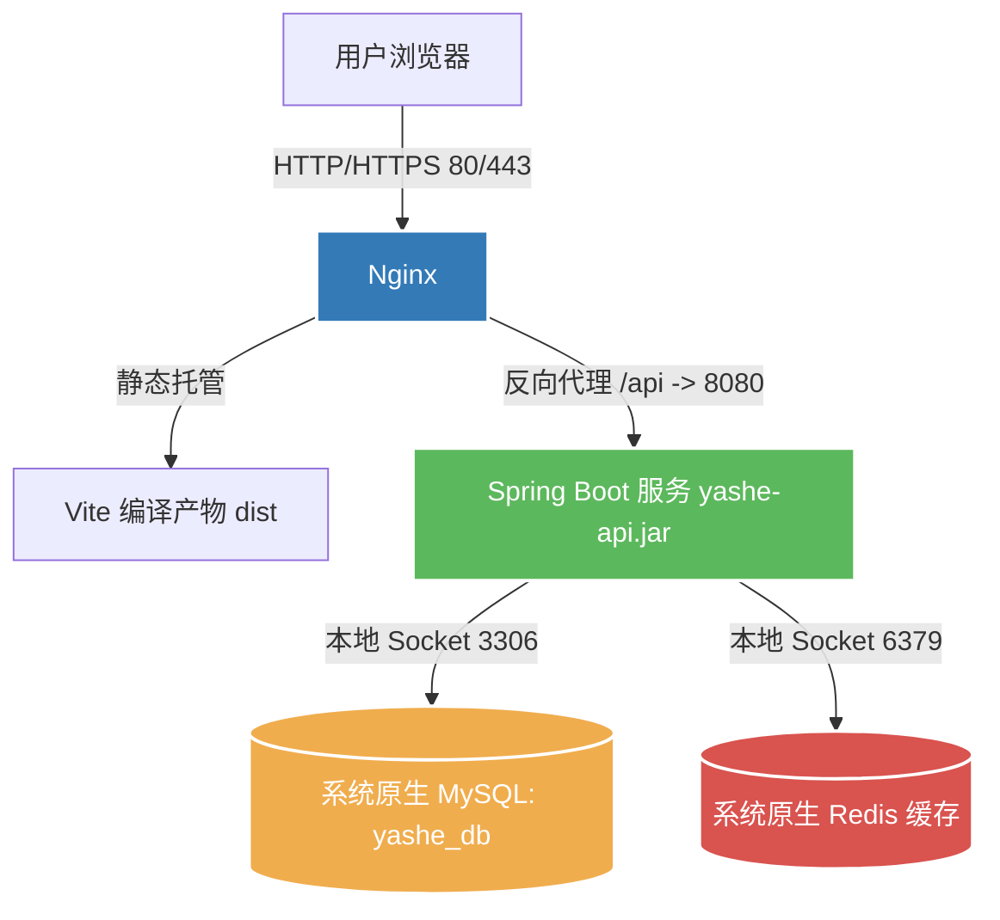

# 阿里云服务器部署准备与实施指南 (雅舍 - Atelier des Miyabi / 原生服务部署版)

本指南专为 **“雅舍 (Atelier des Miyabi)”** 项目量身定制，采用**原生服务部署方式**（不使用 Docker），直接在 Linux 系统上安装运行所需的所有服务。

### 📋 项目技术栈与环境要求
* **前端**：Vite + React + TS (在 `view` 目录下)
* **后端**：Spring Boot 3.2.0 + Java 17 + MyBatis (在 `api` 目录下)
* **数据库**：原生 MySQL 8.0 (库名为 `yashe_db`，账户从受保护环境配置读取)
* **缓存**：原生 Redis
* **部署平台**：阿里云服务器 (ECS) + 阿里云域名备案
* **操作系统建议**：Ubuntu Server 22.04 LTS 或 Alibaba Cloud Linux 3

---

## 📌 整体部署架构与流程图



---

## 🚀 部署前的代码优化 (已完成)
前端有 4 个页面文件（`Contact.tsx`、`AdminLogin.tsx`、`Member.tsx`、`Dashboard.tsx`）存在**硬编码局域网 IP** 的问题：
```javascript
// ❌ 优化前：如果不是 localhost，则会请求固定示例地址（云端无法访问）
const API = window.location.hostname === 'localhost' ? 'http://localhost:8080/api' : 'http://192.0.2.10:8080/api'
```
**优化方案 (已在本地代码中应用)**：
我们已将上述地址修改为**基于当前访问地址动态生成**：
```javascript
//  优化后：在本地开发时访问 localhost:8080，在云端测试/上线时自适应域名或公网 IP 端口
const API = window.location.hostname === 'localhost' ? 'http://localhost:8080/api' : `${window.location.protocol}//${window.location.host}/api`
```

---

## 阶段一：阿里云环境准备与安全加固

### 1. 阿里云 ECS 安全组配置
在阿里云控制台 **“云服务器 ECS” -> “网络与安全” -> “安全组”** 中，为您的实例配置入方向规则：

| 优先级 | 协议类型 | 端口范围 | 授权对象 | 描述 |
| :--- | :--- | :--- | :--- | :--- |
| 1 | 自定义 TCP | `22` (或自定义SSH) | 您的公网 IP (或 `0.0.0.0/0`) | 管理员 SSH 远程登录 |
| 1 | 自定义 TCP | `80` | `0.0.0.0/0` | HTTP 访问（备案完成后启用） |
| 1 | 自定义 TCP | `443` | `0.0.0.0/0` | HTTPS 访问（备案完成后启用） |
| 1 | 自定义 TCP | `8000` | `0.0.0.0/0` | **过渡期测试端口**（备案期间测试前端用） |

> [!CAUTION]
> **绝对不要**在阿里云安全组中开放 `3306` (MySQL) 和 `6379` (Redis) 端口给公网。原生服务必须配置为仅监听本地回环地址 `127.0.0.1`。

### 2. 服务器安全初始化 (SSH 密钥登录)
1. **生成 SSH 密钥对**（本地执行）：`ssh-keygen -t ed25519 -C "admin@yourdomain.com"`。
2. 将公钥绑定至阿里云 ECS 实例。
3. **禁用密码登录**：编辑服务器 `/etc/ssh/sshd_config`，修改如下：
   ```ini
   PasswordAuthentication no
   PubkeyAuthentication yes
   PermitRootLogin no
   ```
4. **重启 SSH 服务**：`sudo systemctl restart ssh`。

---

## 阶段二：原生数据库与缓存安装及初始化

我们直接在服务器的 Linux 系统中下载并运行 MySQL 8.0 与 Redis 服务。

### 1. 原生安装 MySQL 8.0 并初始化
1. **更新包管理器并安装 MySQL**：
   ```bash
   # Ubuntu / Debian:
   sudo apt update && sudo apt install mysql-server -y
   # RedHat / Alibaba Cloud Linux:
   sudo dnf install mysql-server -y
   ```
2. **启动并检查 MySQL 服务状态**：
   ```bash
   # RedHat / Alibaba Cloud Linux:
   sudo systemctl enable --now mysqld
   # Ubuntu:
   sudo systemctl enable --now mysql
   ```
3. **创建数据库、用户与授权**：
   以 root 身份进入数据库（在 Linux 上，初次安装无需密码，可通过 sudo 直接免密登录）：
   ```bash
   sudo mysql
   ```
   进入交互命令行后，依次执行以下 SQL 命令：
   ```sql
   -- 1. 创建雅舍项目专属数据库
   CREATE DATABASE yashe_db DEFAULT CHARACTER SET utf8mb4 DEFAULT COLLATE utf8mb4_unicode_ci;

   -- 2. 创建最小权限应用账户；部署时从安全密码管理器取得真实值
   CREATE USER '<YASHE_DB_USERNAME>'@'localhost' IDENTIFIED BY '<YASHE_DB_PASSWORD>';

   -- 3. 授予该账户对 yashe_db 数据库的所有操作权限
   GRANT SELECT, INSERT, UPDATE, DELETE ON yashe_db.* TO '<YASHE_DB_USERNAME>'@'localhost';

   -- 4. 刷新权限表并退出
   FLUSH PRIVILEGES;
   EXIT;
   ```
4. **导入 `sql/init.sql` 结构**：
   * 创建应用根目录并将本地项目的 `sql/init.sql` 上传至服务器的 `/var/www/yashe/sql/init.sql`。
   * 在服务器终端执行导入命令：
     ```bash
     mysql -u '<YASHE_DB_USERNAME>' -p yashe_db < /var/www/yashe/sql/init.sql
     # 系统会交互式提示输入密码，不要把密码写入命令或脚本
     ```

### 2. 原生安装 Redis 并配置密码安全
1. **安装 Redis 服务**：
   ```bash
   # Ubuntu / Debian:
   sudo apt install redis-server -y
   # RedHat / Alibaba Cloud Linux:
   sudo dnf install redis -y
   ```
2. **修改配置文件以保障安全**：
   编辑配置文件（Ubuntu 路径为 `/etc/redis/redis.conf`，Alibaba Cloud Linux 路径为 `/etc/redis.conf`）：
   ```bash
   sudo nano /etc/redis.conf # 以 Alibaba Cloud Linux 为例
   ```
   * 确保包含以下监听行（限制只能本地回环访问，拒绝公网连接）：
     ```ini
     bind 127.0.0.1 -::1
     ```
   * 找到 `# requirepass foobared` 行，去掉前面的 `#` 符号，并设置复杂密码：
     ```ini
     requirepass <YASHE_REDIS_PASSWORD>
     ```
3. **重启并激活 Redis**：
   ```bash
   # RedHat / Alibaba Cloud Linux:
   sudo systemctl enable --now redis
   # Ubuntu:
   sudo systemctl enable --now redis-server
   ```

---

## 阶段三：Spring Boot 后端部署

### 1. 安装 Java 17 运行环境
```bash
# Ubuntu / Debian:
sudo apt install openjdk-17-jdk -y
# RedHat / Alibaba Cloud Linux:
sudo dnf install java-17-openjdk-devel -y
```

### 2. 本地打包与上传
在本地开发机 `yashe/api` 根目录执行：
```bash
mvn clean package -DskipTests
# 生成 target/yashe-api-1.0.0.jar
```
将生成的 `yashe-api-1.0.0.jar` 上传至服务器的 `/var/www/yashe/backend/`。

### 3. 配置生产环境变量 (.env)
在服务器 `/var/www/yashe/backend/` 下创建 `.env` 文件，内容配置如下（包含您的数据库真实用户名和强密码）：
```env
SERVER_PORT=8080
SERVER_ADDRESS=127.0.0.1

YASHE_DB_URL=jdbc:mysql://127.0.0.1:3306/yashe_db?useUnicode=true&characterEncoding=utf-8&serverTimezone=Asia/Shanghai
YASHE_DB_USERNAME=<YASHE_DB_USERNAME>
YASHE_DB_PASSWORD=<YASHE_DB_PASSWORD>

# 从安全密码管理器生成并注入不少于 32 字节的随机签名密钥
YASHE_JWT_SECRET=<YASHE_JWT_SECRET>
YASHE_JWT_ACCESS_TTL=PT60M
YASHE_JWT_ISSUER=yashe-api
YASHE_JWT_AUDIENCE=yashe-web
YASHE_TURNSTILE_SECRET_KEY=<TURNSTILE_SECRET_KEY>

# 跨域白名单（允许前端部署的域名访问接口）
YASHE_ALLOWED_ORIGINS=https://www.admys.cn,https://admys.cn,https://yashe.pages.dev
```

### 4. 使用 Systemd 守护进程运行
通过加载 `.env` 配置文件来启动后端服务。创建或修改服务配置文件 `/etc/systemd/system/yashe-api.service`：
```ini
[Unit]
Description=Yashe Atelier des Miyabi API Service
After=syslog.target network.target mysql.service redis-server.service

[Service]
User=<NON_ROOT_DEPLOY_USER>
WorkingDirectory=/var/www/yashe/backend
# 加载 .env 环境变量文件进入 Systemd
EnvironmentFile=/var/www/yashe/backend/.env
ExecStart=/usr/bin/java -jar yashe-api-1.0.0.jar
SuccessExitStatus=143
Restart=always
RestartSec=10

[Install]
WantedBy=multi-user.target
```
启动后端服务并设为开机自启：
```bash
sudo systemctl daemon-reload
sudo systemctl start yashe-api
sudo systemctl enable yashe-api
```

---

## 阶段四：Vite + TS 前端打包与 Nginx 静态托管

### 1. 本地打包与上传
在本地 `yashe/view` 根目录下执行：
```bash
npm run build
# 生成 dist 文件夹
```
将 `dist/` 文件夹整体上传到服务器目录 `/var/www/yashe/frontend/`。

### 2. 安装并配置 Nginx
```bash
# Ubuntu / Debian:
sudo apt install nginx -y
# RedHat / Alibaba Cloud Linux:
sudo dnf install nginx -y
```
修改 Nginx 默认配置文件（Alibaba Cloud Linux 为 `/etc/nginx/nginx.conf`，Ubuntu 为 `/etc/nginx/sites-available/default`）：
```nginx
server {
    listen 8000; # 备案期间使用 8000 端口提供测试服务
    server_name _;

    # 前端静态资源托管
    location / {
        root /var/www/yashe/frontend;
        index index.html;
        try_files $uri $uri/ /index.html; # 支持 React Router 的 History 模式
    }

    # 后端接口反向代理
    # ⚠️ 关键避坑提示：proxy_pass 末尾千万不能加斜杠 "/"。
    location /api {
        proxy_pass http://127.0.0.1:8080; 
        proxy_set_header Host $host;
        proxy_set_header X-Real-IP $remote_addr;
        proxy_set_header X-Forwarded-For $proxy_add_x_forwarded_for;
        proxy_set_header X-Forwarded-Proto $scheme;
    }
}
```
保存并重载 Nginx：
```bash
sudo nginx -t
sudo systemctl restart nginx
```

---

## 阶段五：备案期间过渡与上线调试

根据阿里云合规规则，**备案期间绑定域名到大陆服务器的 80/443 会被防火墙自动拦截**。
1. **联调访问**：通过浏览器访问 `http://<您的阿里云ECS公网IP>:8000` 即可直接预览与联调完整的前后端页面。由于我们优化了 API 接口获取方式，网络请求会自动发送至 `http://<您的阿里云ECS公网IP>:8000/api/...`，并由 Nginx 代理分发至后端的 8080 端口。
2. **本地 hosts 欺骗测试**：
   在本地电脑修改 hosts 映射：`<IP> yourdomain.com`，然后在浏览器访问 `http://yourdomain.com:8000` 即可完全模拟域名访问。

---

## 阶段六：备案通过后的上线步骤

当您收到短信通知备案通过后，依次执行以下步骤：

### 1. 修改 Nginx 配置启用 80 端口
将端口由 `8000` 改为 `80`，并配置真实域名：
```nginx
server {
    listen 80;
    server_name yourdomain.com www.yourdomain.com;
    
    # 其余托管和反向代理逻辑保持不变...
}
```
保存并重新加载配置：`sudo nginx -t && sudo systemctl reload nginx`。

### 2. 使用 Certbot 部署 SSL 证书 (HTTPS)
运行以下命令，为域名快速部署免费且自动续期的 HTTPS：
```bash
sudo apt install certbot python3-certbot-nginx -y
sudo certbot --nginx -d yourdomain.com -d www.yourdomain.com
```

### 3. 在网页底部悬挂备案号
修改全局底部组件，在网页底部添加链接：
```html
<a href="https://beian.miit.gov.cn/" target="_blank" style="color: #999; text-decoration: none; font-size: 12px;">
  您的ICP备案号
</a>
```
